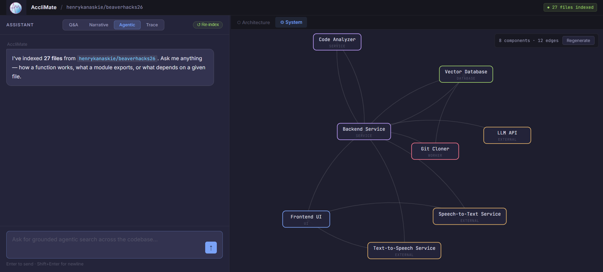

# AccliMate

**Codebase onboarding assistant** — paste a GitHub URL, get an interactive RAG-powered guide to any repository.

Built at [BeaverHacks 2026](https://beaverhacks.org/) (Oregon State University).



---

## What it does

AccliMate clones a public GitHub/GitLab repo, chunks the source with AST-aware splitting, embeds it into a local vector database, and exposes an interactive UI with four modes:

| Mode | Description |
|------|-------------|
| **Q&A** | Ask natural-language questions grounded in the actual code. Inline citations link directly to the relevant lines. |
| **Narrative** | Step-through animated walkthroughs that highlight components and animate data-flow on a system diagram. |
| **Agentic** | Multi-tool agent that can search symbols, read files, trace dependencies, and synthesize an answer. |
| **Trace** | Click any file to see its direct and transitive dependents across the repo. |

### Key features

- **AST-aware chunking** — code files are split by functions/classes via tree-sitter; docs and config use line-based chunking
- **System architecture diagram** — auto-generated logical component map (D3.js force layout) with animated data-flow edges
- **Inline code citations** — every claim links to the exact source lines; click to open a syntax-highlighted viewer
- **Zoom deep-dive** — click a system component to get an LLM-generated explanation of its internals
- **Architecture tree** — collapsible file/folder tree with substring search highlighting
- **Re-indexing** — force re-index from the viewer when you need fresh data
- **Project management** — recent repos on the landing page with one-click delete

---

## Architecture

```
Browser (index.html / view.html)
   │
   ▼
FastAPI  (main.py, port 8000)
   ├── POST /index          → clone + chunk + embed (background task)
   ├── GET  /files/{id}     → file list from index
   ├── GET  /file/{id}      → reconstruct file from chunks
   ├── GET  /architecture/{id} → folder/file tree
   ├── POST /query          → RAG retrieval + rerank + LLM answer
   ├── GET  /system/{id}    → cached system diagram (LLM-generated)
   ├── POST /narrative/{id} → step-by-step animated walkthrough
   ├── POST /zoom/{id}      → per-component deep dive
   ├── POST /trace          → dependency graph traversal
   ├── POST /agent          → multi-tool agentic pipeline
   └── CRUD /projects       → recent project registry
   │
   ▼
ChromaDB (local persistent)     NVIDIA NIM API
  └── per-repo collections        ├── Nemotron Super 49B (Q&A)
      with code + doc chunks       └── Mistral-Nemotron (diagrams, narrative, zoom)
```

### Embedding pipeline

1. **Clone** — `git clone --depth 1` with timeout + auth detection
2. **Collect** — walk all files, skip binaries (`EXCLUDE_EXTENSIONS`), tag each as `is_code` or doc
3. **Chunk** — AST splitting (tree-sitter via LlamaIndex `CodeSplitter`) for code; line-based for everything else
4. **Embed** — Salesforce CodeT5+ (110M) locally, fallback to all-MiniLM-L6-v2
5. **Store** — ChromaDB with metadata: `file_path`, `start_line`, `end_line`, `language`, `content_type`
6. **Rerank** — cross-encoder/ms-marco-MiniLM-L-6-v2 at query time

---

## Quickstart

### Prerequisites

- Python 3.11+
- Git on PATH
- NVIDIA NIM API key ([build.nvidia.com](https://build.nvidia.com))

### Setup

```bash
# Clone
git clone https://github.com/YOUR_USER/beaverhacks26.git
cd beaverhacks26

# Virtual environment
python -m venv .venv
source .venv/bin/activate   # Windows: .venv\Scripts\activate

# Dependencies
pip install -r requirements.txt

# Environment
cp app/.env.example app/.env
# Edit app/.env and add your NVIDIA_API_KEY
```

### Run

```bash
cd app
python main.py
```

Open [http://localhost:8000](http://localhost:8000), paste a GitHub URL, and start exploring.

---

## Tech stack

| Layer | Technology |
|-------|-----------|
| Backend | FastAPI + Uvicorn |
| Vector DB | ChromaDB (persistent, local) |
| Code parsing | tree-sitter (via LlamaIndex CodeSplitter) |
| Embeddings | Salesforce CodeT5+ 110M (local) |
| Reranking | cross-encoder/ms-marco-MiniLM-L-6-v2 (local) |
| LLM | NVIDIA NIM — Nemotron Super 49B, Mistral-Nemotron |
| Frontend | Vanilla JS, D3.js v7, Prism.js |
| Diagram | D3 force simulation (system) + D3 tree (architecture) |

---

## Project structure

```
app/
├── main.py          # FastAPI entrypoint, router registration
├── ingest.py        # Clone → collect → chunk → embed → store pipeline
├── query.py         # RAG retrieval, reranking, LLM Q&A
├── system.py        # System diagram generation, narrative steps, zoom
├── agent.py         # Multi-tool agentic pipeline
├── files.py         # File list, content reconstruction, architecture tree
├── trace.py         # Dependency graph traversal
├── deps_builder.py  # Build import/dependency graph from AST
├── db.py            # ChromaDB client singleton
├── llm.py           # Role-based NVIDIA LLM configuration
├── constants.py     # Extensions, exclusions, language map
├── projects.py      # Recent projects CRUD + registry
├── progress.py      # Indexing progress tracking
├── static/
│   ├── index.html   # Landing page — URL input, recent projects
│   ├── view.html    # Main workspace — chat, diagrams, code viewer
│   ├── app.js       # Landing page JS — indexing, progress polling
│   └── logo.png     # AccliMate logo
```

---

## Environment variables

| Variable | Required | Description |
|----------|----------|-------------|
| `NVIDIA_API_KEY` | Yes | NIM API key for Nemotron Super (Q&A) |
| `NANO_API_KEY` | No | Separate key for Mistral-Nemotron roles; falls back to `NVIDIA_API_KEY` |
| `MAX_FILES_PER_REPO` | No | File count limit (default: 5000) |
| `CLONE_TIMEOUT_SECONDS` | No | Git clone timeout (default: 300) |
| `LLM_MODEL_<ROLE>` | No | Override model per role (QA, NARRATIVE, SYSTEM_DIAGRAM, ZOOM) |
| `LLM_TEMPERATURE_<ROLE>` | No | Override temperature per role |

---

## Creators

Kellen Sullivan, Henry Kanaskie, Zachary Allen & Dylan Brehm

---

*Built with ☕ at BeaverHacks 2026 — Oregon State University*
